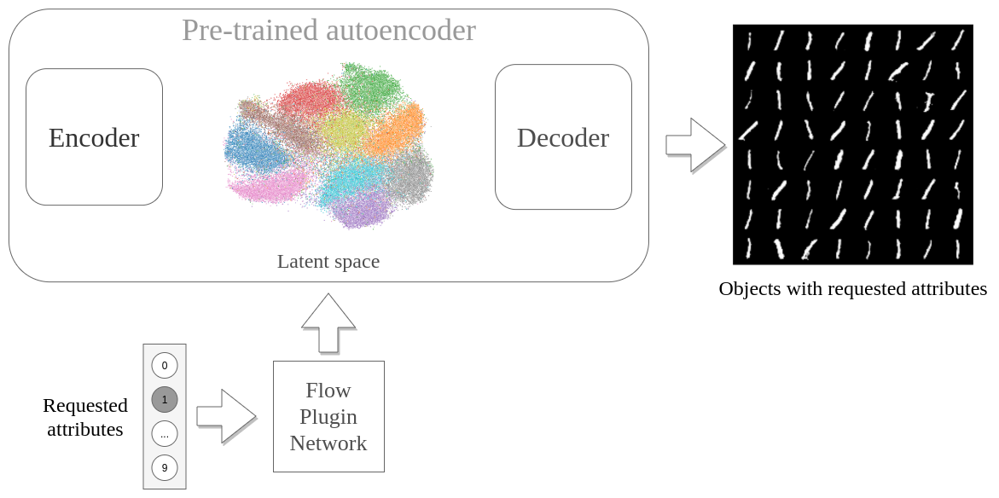

<h1 align="center">
  Flow Plugin Network for conditional generation 
   
</h1>

<h4 align="center">Patryk Wielopolski, Michał Koperski, Maciej Zięba</h4>

> Generative models have gained many researcher's attention in the last years resulting in models such as StyleGAN for human face generation or PointFlow for 3D point cloud generation. However, by default, we cannot control its sampling process, i.e., we cannot generate a sample with a specific set of the attributes. The current approach is model retraining with additional inputs and different architecture, which requires time and computational resources. We propose a novel approach that enables to generate objects with a given set of attributes without retraining the base model. For this purpose, we utilize the normalizing flow models - Conditional Masked Autoregressive Flow and Conditional Real NVP, as a Flow Plugin Network (FPN).

## Idea

## Authors
  * **Patryk Wielopolski** - Wrocław University of Science and Technology
  * **Michał Koperski** - Tooploox Ltd. - [Webpage](http://mkoperski.com) 
  * **Maciej Zięba** - Wrocław University of Science and Technology, Tooploox Ltd. - [Webpage](https://www.ii.pwr.edu.pl/~zieba/) 
